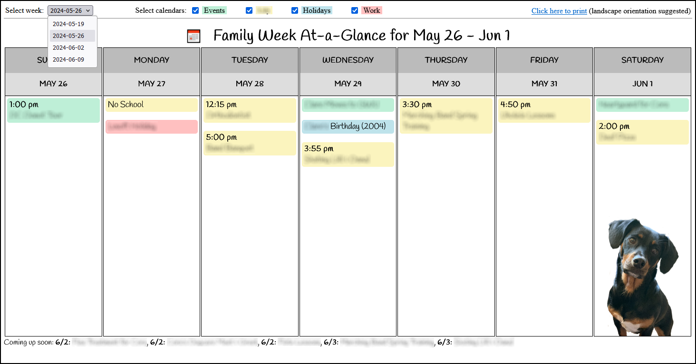
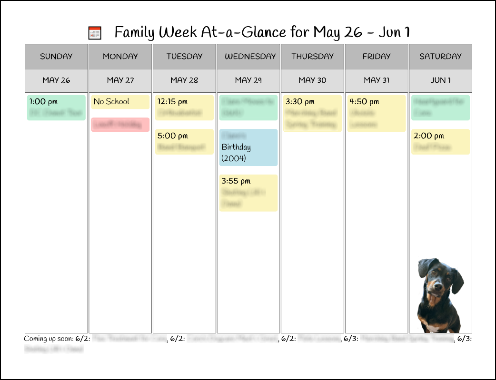

# Printable Weekly Agenda
Web based weekly calendar with print-friendly CSS layout

## Background
I currently maintain my family and personal calendars on Outlook. I pull those calendars down and use them in a few places like my private wiki, and I also wanted a weekly view of events that I could print out and share/display for my family.  This code/repo focuses primarily on the capability to format that display on the web as well as a print-friendly layout.

## What You'll Need
- PHP

## My Approach
This is not the cleanest or most scalable code, but the quick and dirty suits my personal needs. By default, the page loads displaying the current week and provides a dropdown to select weeks within the previous and next 15 days from "today".  There are also checkboxes to toggle the display of specific calendars.  These elements are hidden in print view.

To create the week grid, I determine the date of this week's Sunday, then iterate for seven days.  If the date of the iterator matches an event date, display it with appropriate styling.

For display and printing, I wanted each day cell to fill all vertical space.  This is accomplished primarily with the following CSS:
```
.weektable {
    border: 0;
    height: 80vh;
    table-layout: fixed;
    width: 100%;
}
@media print {
    .weektable {
        height: 85vh;
    }
}
```

The footer includes a "coming soon" list of events occuring next Sunday and Monday, but that code isn't relavant to this specific repo.  I also include a thumbnail of our family dog on the bottom of the Saturday cell because she's a fool.

## Screenshots

### Web View


### Print View

